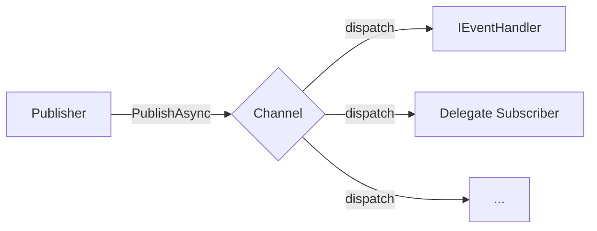

# EventBus Event Bus

`EventBus` is a publish/subscribe event bus based on lifecycle services. It is located in the `PCL.Core.App.EventBus` namespace and is used to decouple event publishers from event handlers.

All event-bus-related capabilities are exposed through `EventBusService`.



## Overview

`EventBus` distributes events by channel. After a publisher publishes event data to a specified channel, handlers that have subscribed to that channel and are compatible with the event data type will be called.

A channel can have multiple subscribers at the same time. Subscribers can be objects that implement `IEventHandler<TEventData>`, or asynchronous delegates.

| Concept               | Description                                                                        |
|-----------------------|------------------------------------------------------------------------------------|
| Event data            | A data object that inherits from `EventDataBase`                                   |
| Channel               | A logical group for event publishing and subscription, identified by a string name |
| Publisher             | The party that calls `PublishAsync` to publish events to a channel                 |
| Subscriber            | An event handler registered to a channel through `Subscribe`                       |
| Object subscription   | Handles events through an `IEventHandler<TEventData>` instance                     |
| Delegate subscription | Handles events through an asynchronous delegate                                    |

## Core Types

### `EventDataBase`

The base class for event data. All custom event data must inherit from this type.

```cs
public record EventDataBase(Guid Id, string Name);
```

#### Parameters

| Parameter | Type     | Description             |
|-----------|----------|-------------------------|
| `Id`      | `Guid`   | Unique event identifier |
| `Name`    | `string` | Event name              |

#### Example

```cs
public sealed record FileDownloadedEvent(
    Guid Id,
    string Name,
    string FilePath
) : EventDataBase(Id, Name);
```

### `IEventHandler<TEventData>`

The event handling interface. Instances that implement this interface can be registered as event handlers through `EventBusService.Subscribe`.

```cs
public interface IEventHandler<in TEventData> : IDisposable
{
    Task HandleEventAsync(TEventData eventData);
}
```

#### Type Parameters

| Parameter    | Constraint      | Description                                             |
|--------------|-----------------|---------------------------------------------------------|
| `TEventData` | `EventDataBase` | The event data type that the current handler can handle |

#### Methods

| Method                                   | Description                                   |
|------------------------------------------|-----------------------------------------------|
| `HandleEventAsync(TEventData eventData)` | Handles event data                            |
| `Dispose()`                              | Releases resources held by the handler itself |

#### Example

```cs
public sealed class DownloadNotificationHandler
    : IEventHandler<FileDownloadedEvent>
{
    public async Task HandleEventAsync(FileDownloadedEvent eventData)
    {
        await File.AppendAllTextAsync(
            "download.log",
            $"[{DateTime.Now}] Downloaded: {eventData.FilePath}\n"
        );
    }

    public void Dispose()
    {
    }
}
```

## `EventBusService`

`EventBusService` is the unified access entry point for the event bus. It is responsible for channel management, event subscription, and event publishing.

### `Subscribe`

Subscribes an event handler to a specified channel.

#### Object Subscription

```cs
EventBusService.Subscribe("channel-name", handler);
```

Object subscription accepts a handler instance that implements `IEventHandler<TEventData>`.

```cs
IDisposable subscription =
    EventBusService.Subscribe<FileDownloadedEvent>(
        "download",
        new DownloadNotificationHandler()
    );
```

#### Delegate Subscription

```cs
EventBusService.Subscribe<MyEventData>("channel-name", async data =>
{
    // handle event
});
```

Delegate subscription is suitable for scenarios where the handling logic is short and no separate handler state needs to be maintained.

```cs
IDisposable subscription =
    EventBusService.Subscribe<FileDownloadedEvent>(
        "download",
        async data =>
        {
            await File.AppendAllTextAsync("download.log", data.FilePath);
        }
    );
```

#### Return Value

`Subscribe` returns an `IDisposable` instance. Calling the `Dispose()` method on this instance cancels the subscription.

```cs
subscription.Dispose();
```

#### Behavior

* If the channel specified during subscription does not exist, `EventBusService` will automatically create it.
* Multiple subscribers can be registered to the same channel.
* Subscribers only handle events compatible with their event data type.
* Object subscriptions hold handler instances through weak references. See “Garbage Collection Behavior” for details.

### `PublishAsync`

Publishes an event to a specified channel.

```cs
await EventBusService.PublishAsync("channel-name", eventData);
```

#### Example

```cs
await EventBusService.PublishAsync(
    "download",
    new FileDownloadedEvent(
        Guid.NewGuid(),
        "download-complete",
        filePath
    )
);
```

#### Behavior

* The event is dispatched to all compatible handlers subscribed to the target channel.
* Multiple handlers are called in parallel.
* An exception thrown by a single handler does not prevent other handlers from running.
* If `EventBus` is shutting down, publishing an event will throw an `InvalidOperationException`.

### `AddChannel`

Explicitly creates a channel.

```cs
EventBusService.AddChannel("channel-name");
```

You usually do not need to create channels manually, because `Subscribe` automatically creates a channel if it does not exist. Explicit channel creation is suitable for scenarios where a channel needs to be initialized in advance, or where the existence of the channel needs to be expressed.

### `RemoveChannel`

Removes the specified channel.

```cs
EventBusService.RemoveChannel("channel-name");
```

When a channel is removed, all subscribers in that channel are also cleared.

## Channels

Channels are used to isolate events of different types or from different sources. A channel name is a string and is agreed upon by the caller.

```cs
const string DownloadChannel = "download";
```

It is recommended to define channel names as constants to avoid writing string literals directly in multiple places.

```cs
public static class EventChannels
{
    public const string Download = "download";
}
```

## Lifecycle Behavior

`EventBus` runs based on lifecycle services, and its availability is related to the application lifecycle.

| Phase               | Behavior                                                                                           |
|---------------------|----------------------------------------------------------------------------------------------------|
| Early program stage | The service starting state is `BeforeLoading`, so the event bus is already available at this point |
| Normal runtime      | Channels can be created, events can be subscribed to, and events can be published                  |
| Program shutdown    | All channels and handlers are automatically cleared                                                |
| Shutting down       | Calling `PublishAsync` throws an `InvalidOperationException`                                       |

## Garbage Collection Behavior

Object subscriptions hold handler instances through `WeakReference<object>`.

When a handler instance has already been garbage collected but the corresponding subscription has not been explicitly canceled, the event bus automatically removes that subscription item during the next event dispatch.

This mechanism can reduce the risk of object leaks caused by forgetting to unsubscribe, but it should not replace explicit disposal. For subscriptions with a clear lifecycle, it is still recommended to keep the `IDisposable` returned by `Subscribe` and call `Dispose()` when the subscription is no longer needed.

## Exception Behavior

When an event is published, exceptions thrown by handlers do not affect the execution of other handlers.

```cs
await EventBusService.PublishAsync("channel-name", eventData);
```

If multiple handlers have subscribed to the same channel and one handler throws an exception while handling the event, the other handlers will still continue to run.

Calling `PublishAsync` while `EventBus` is shutting down will throw an `InvalidOperationException`.

## Complete Example

The following example shows the complete structure of event data definition, event handler implementation, event subscription, event publishing, and subscription cancellation.

```cs
public sealed record FileDownloadedEvent(
    Guid Id,
    string Name,
    string FilePath
) : EventDataBase(Id, Name);

public sealed class DownloadNotificationHandler
    : IEventHandler<FileDownloadedEvent>
{
    public async Task HandleEventAsync(FileDownloadedEvent eventData)
    {
        await File.AppendAllTextAsync(
            "download.log",
            $"[{DateTime.Now}] Downloaded: {eventData.FilePath}\n"
        );
    }

    public void Dispose()
    {
    }
}

public static class DownloadManager
{
    private const string ChannelName = "download";

    private static readonly IDisposable Subscription =
        EventBusService.Subscribe<FileDownloadedEvent>(
            ChannelName,
            new DownloadNotificationHandler()
        );

    public static async Task DownloadAsync(string url)
    {
        // download file

        await EventBusService.PublishAsync(
            ChannelName,
            new FileDownloadedEvent(
                Guid.NewGuid(),
                "download-complete",
                url
            )
        );
    }

    public static void Unsubscribe()
    {
        Subscription.Dispose();
    }
}
```

## API Summary

### Types

| API                         | Description                   |
|-----------------------------|-------------------------------|
| `EventDataBase`             | Base class for all event data |
| `IEventHandler<TEventData>` | Event handling interface      |
| `EventBusService`           | Event bus service entry point |

### `EventBusService` Members

| API                  | Description                                 |
|----------------------|---------------------------------------------|
| `Subscribe(...)`     | Subscribes to events on a specified channel |
| `PublishAsync(...)`  | Publishes events to a specified channel     |
| `AddChannel(...)`    | Explicitly creates a channel                |
| `RemoveChannel(...)` | Removes a channel and its subscribers       |

## Usage Recommendations

* Channel names should be uniformly defined as constants to avoid scattering hard-coded strings across different files.
* Long-lived subscriptions should keep the `IDisposable` returned by `Subscribe`, and call `Dispose()` when they are no longer needed.
* Event data should use immutable `record` types to avoid accidental modification during handling.
* Complex handling logic should be implemented using `IEventHandler<TEventData>`, while simple logic can use delegate subscription.
* Do not rely on subscriber execution order. Multiple subscribers run in parallel.