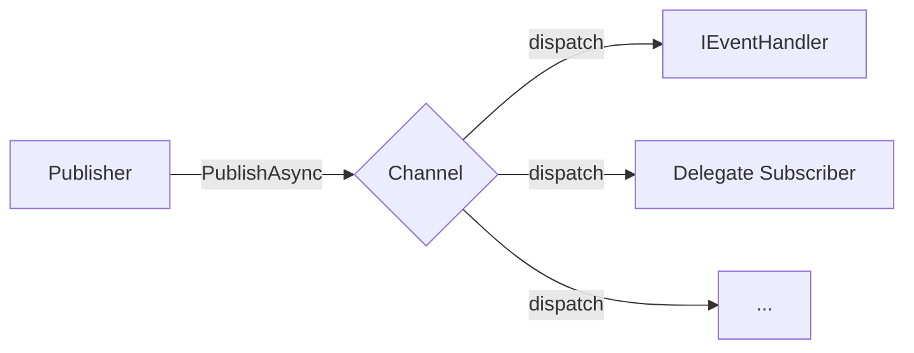

# EventBus 事件总线

`EventBus` 是基于生命周期服务的发布/订阅式事件总线，位于 `PCL.Core.App.EventBus` 命名空间，用于解耦事件发布者与事件处理者。

所有事件总线相关能力均通过 `EventBusService` 公开。



## 概览

`EventBus` 以频道为单位分发事件。发布者向指定频道发布事件数据后，订阅了该频道且事件数据类型兼容的处理者会被调用。

一个频道可以同时存在多个订阅者。订阅者可以是实现 `IEventHandler<TEventData>` 的对象，也可以是异步委托。

| 概念   | 说明                                    |
|------|---------------------------------------|
| 事件数据 | 继承自 `EventDataBase` 的数据对象             |
| 频道   | 事件发布与订阅的逻辑分组，由字符串名称标识                 |
| 发布者  | 调用 `PublishAsync` 向频道发布事件的一方          |
| 订阅者  | 通过 `Subscribe` 注册到频道的事件处理者            |
| 对象订阅 | 通过 `IEventHandler<TEventData>` 实例处理事件 |
| 委托订阅 | 通过异步委托处理事件                            |

## 核心类型

### `EventDataBase`

事件数据的基类，所有自定义事件数据均需继承该类型。

```cs
public record EventDataBase(Guid Id, string Name);
```

#### 参数

| 参数     | 类型       | 说明     |
|--------|----------|--------|
| `Id`   | `Guid`   | 事件唯一标识 |
| `Name` | `string` | 事件名称   |

#### 示例

```cs
public sealed record FileDownloadedEvent(
    Guid Id,
    string Name,
    string FilePath
) : EventDataBase(Id, Name);
```

### `IEventHandler<TEventData>`

事件处理接口。实现该接口的实例可通过 `EventBusService.Subscribe` 注册为事件处理者。

```cs
public interface IEventHandler<in TEventData> : IDisposable
{
    Task HandleEventAsync(TEventData eventData);
}
```

#### 类型参数

| 参数           | 约束              | 说明              |
|--------------|-----------------|-----------------|
| `TEventData` | `EventDataBase` | 当前处理者可处理的事件数据类型 |

#### 方法

| 方法                                       | 说明           |
|------------------------------------------|--------------|
| `HandleEventAsync(TEventData eventData)` | 处理事件数据       |
| `Dispose()`                              | 释放处理者自身持有的资源 |

#### 示例

```cs
public sealed class DownloadNotificationHandler
    : IEventHandler<FileDownloadedEvent>
{
    public async Task HandleEventAsync(FileDownloadedEvent eventData)
    {
        await File.AppendAllTextAsync(
            "download.log",
            $"[{DateTime.Now}] Downloaded: {eventData.FilePath}\n"
        );
    }

    public void Dispose()
    {
    }
}
```

## `EventBusService`

`EventBusService` 是事件总线的统一访问入口，负责频道管理、事件订阅和事件发布。

### `Subscribe`

将事件处理者订阅到指定频道。

#### 对象订阅

```cs
EventBusService.Subscribe("channel-name", handler);
```

对象订阅接收一个实现 `IEventHandler<TEventData>` 的处理者实例。

```cs
IDisposable subscription =
    EventBusService.Subscribe<FileDownloadedEvent>(
        "download",
        new DownloadNotificationHandler()
    );
```

#### 委托订阅

```cs
EventBusService.Subscribe<MyEventData>("channel-name", async data =>
{
    // handle event
});
```

委托订阅适合处理逻辑较短、无需单独维护处理者状态的场景。

```cs
IDisposable subscription =
    EventBusService.Subscribe<FileDownloadedEvent>(
        "download",
        async data =>
        {
            await File.AppendAllTextAsync("download.log", data.FilePath);
        }
    );
```

#### 返回值

`Subscribe` 返回一个 `IDisposable` 实例。调用该实例的 `Dispose()` 方法可取消订阅。

```cs
subscription.Dispose();
```

#### 行为

* 如果订阅时指定的频道不存在，`EventBusService` 会自动创建该频道。
* 同一频道可以注册多个订阅者。
* 订阅者只会处理与其事件数据类型兼容的事件。
* 对象订阅通过弱引用持有处理者实例，详见“垃圾回收行为”。

### `PublishAsync`

向指定频道发布事件。

```cs
await EventBusService.PublishAsync("channel-name", eventData);
```

#### 示例

```cs
await EventBusService.PublishAsync(
    "download",
    new FileDownloadedEvent(
        Guid.NewGuid(),
        "download-complete",
        filePath
    )
);
```

#### 行为

* 事件会被派发给订阅了目标频道的所有兼容处理者。
* 多个处理者会被并行调用。
* 单个处理者抛出的异常不会阻止其他处理者执行。
* 如果 `EventBus` 正在关闭，发布事件会抛出 `InvalidOperationException`。

### `AddChannel`

显式创建频道。

```cs
EventBusService.AddChannel("channel-name");
```

通常不需要手动创建频道，因为 `Subscribe` 会在频道不存在时自动创建频道。显式创建频道适合需要提前初始化频道，或需要表达频道存在性的场景。

### `RemoveChannel`

移除指定频道。

```cs
EventBusService.RemoveChannel("channel-name");
```

移除频道时，该频道中的所有订阅者也会被清除。

## 频道

频道用于隔离不同类型或不同来源的事件。频道名称为字符串，由调用方自行约定。

```cs
const string DownloadChannel = "download";
```

建议将频道名称定义为常量，避免在多处代码中直接书写字符串。

```cs
public static class EventChannels
{
    public const string Download = "download";
}
```

## 生命周期行为

`EventBus` 基于生命周期服务运行，其可用状态与应用生命周期相关。

| 阶段   | 行为                                                |
|------|---------------------------------------------------|
| 程序早期 | 服务启动状态为 `BeforeLoading`，此时事件总线已可用                 |
| 正常运行 | 可以创建频道、订阅事件和发布事件                                  |
| 程序停止 | 自动清空所有频道与处理者                                      |
| 正在关闭 | 调用 `PublishAsync` 会抛出 `InvalidOperationException` |

## 垃圾回收行为

对象订阅通过 `WeakReference<object>` 持有处理者实例。

当处理者实例已经被垃圾回收，但对应订阅尚未显式取消时，事件总线会在下一次事件派发时自动移除该订阅项。

该机制可以降低忘记取消订阅导致的对象泄漏风险，但不应替代显式释放。对于生命周期明确的订阅，仍建议保存 `Subscribe` 返回的 `IDisposable`，并在不再需要时调用 `Dispose()`。

## 异常行为

事件发布时，处理者抛出的异常不会影响其他处理者执行。

```cs
await EventBusService.PublishAsync("channel-name", eventData);
```

如果多个处理者订阅了同一频道，其中一个处理者在处理事件时抛出异常，其他处理者仍会继续执行。

当 `EventBus` 正在关闭时调用 `PublishAsync`，会抛出 `InvalidOperationException`。

## 完整示例

以下示例展示事件数据定义、事件处理者实现、事件订阅、事件发布与取消订阅的完整结构。

```cs
public sealed record FileDownloadedEvent(
    Guid Id,
    string Name,
    string FilePath
) : EventDataBase(Id, Name);

public sealed class DownloadNotificationHandler
    : IEventHandler<FileDownloadedEvent>
{
    public async Task HandleEventAsync(FileDownloadedEvent eventData)
    {
        await File.AppendAllTextAsync(
            "download.log",
            $"[{DateTime.Now}] Downloaded: {eventData.FilePath}\n"
        );
    }

    public void Dispose()
    {
    }
}

public static class DownloadManager
{
    private const string ChannelName = "download";

    private static readonly IDisposable Subscription =
        EventBusService.Subscribe<FileDownloadedEvent>(
            ChannelName,
            new DownloadNotificationHandler()
        );

    public static async Task DownloadAsync(string url)
    {
        // download file

        await EventBusService.PublishAsync(
            ChannelName,
            new FileDownloadedEvent(
                Guid.NewGuid(),
                "download-complete",
                url
            )
        );
    }

    public static void Unsubscribe()
    {
        Subscription.Dispose();
    }
}
```

## API 摘要

### 类型

| API                         | 说明        |
|-----------------------------|-----------|
| `EventDataBase`             | 所有事件数据的基类 |
| `IEventHandler<TEventData>` | 事件处理接口    |
| `EventBusService`           | 事件总线服务入口  |

### `EventBusService` 成员

| API                  | 说明        |
|----------------------|-----------|
| `Subscribe(...)`     | 订阅指定频道的事件 |
| `PublishAsync(...)`  | 向指定频道发布事件 |
| `AddChannel(...)`    | 显式创建频道    |
| `RemoveChannel(...)` | 移除频道及其订阅者 |

## 使用建议

* 频道名称建议统一定义为常量，避免硬编码字符串分散在不同文件中。
* 长生命周期订阅应保存 `Subscribe` 返回的 `IDisposable`，并在不再需要时调用 `Dispose()`。
* 事件数据应使用不可变 `record` 类型，避免处理过程中被意外修改。
* 复杂处理逻辑建议使用 `IEventHandler<TEventData>` 实现，简单逻辑可以使用委托订阅。
* 不应依赖订阅者执行顺序。多个订阅者会并行执行。
