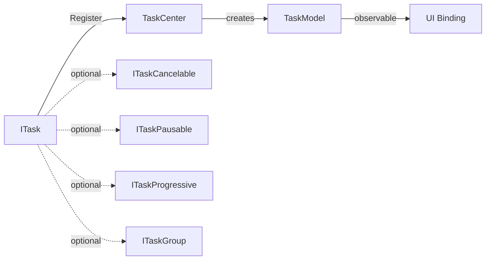

# Tasks 响应式任务系统

`Tasks` 是 PCL CE 核心库中基于响应式模型的任务系统，位于 `PCL.Core.App.Tasks` 命名空间，用于管理可观察的后台任务生命周期。

任务通过 `TaskCenter` 注册。注册后，系统会为任务创建可绑定到 UI 的 `TaskModel` 实例，并自动同步任务状态、进度、子任务集合和控制命令。

::: warning API 状态
此 API 仍在设计开发中，后续版本可能存在变动，请以实际行为为准。
:::



## 概览

`Tasks` 系统以 `ITask` 为基本任务单元，以 `TaskModel` 作为 UI 可观察模型，以 `TaskCenter` 作为任务注册与管理入口。

| 概念    | 说明                          |
|-------|-----------------------------|
| 任务    | 实现 `ITask` 的后台执行单元          |
| 任务状态  | 由 `TaskState` 表示的任务运行状态     |
| 任务模型  | 由 `TaskCenter` 创建的 UI 可观察模型 |
| 任务中心  | 负责注册任务、启动任务和维护任务集合          |
| 可取消任务 | 实现 `ITaskCancelable` 的任务    |
| 可暂停任务 | 实现 `ITaskPausable` 的任务      |
| 进度任务  | 实现 `ITaskProgressive` 的任务   |
| 任务组   | 实现 `ITaskGroup` 的复合任务       |

任务系统的典型数据流为：

1. 调用方创建一个实现 `ITask` 的任务实例。
2. 调用方通过 `TaskCenter.Register` 注册任务。
3. `TaskCenter` 创建对应的 `TaskModel`。
4. `TaskCenter` 订阅任务状态、进度和子任务事件。
5. UI 绑定 `TaskCenter.Tasks` 或对应 `TaskModel`。
6. 任务执行期间，状态变化会同步反映到 UI 模型中。

## `ITask`

`ITask` 是响应式任务的核心接口。所有可注册到任务系统中的任务都必须实现该接口。

```cs
public delegate void TaskStateEvent(TaskState state, string message);

public interface ITask
{
    string Title { get; }

    Task ExecuteAsync(CancellationToken cancelToken = default);

    event TaskStateEvent StateChanged;
}
```

### 成员

| 成员             | 类型                     | 说明       |
|----------------|------------------------|----------|
| `Title`        | `string`               | 任务标题     |
| `ExecuteAsync` | `Task`                 | 执行任务主体逻辑 |
| `StateChanged` | `event TaskStateEvent` | 任务状态变更事件 |

### 行为约定

`ExecuteAsync` 用于执行任务逻辑。任务实现者应在执行过程中通过 `StateChanged` 报告状态变化。

`TaskCenter` 会在注册任务时自动订阅 `StateChanged`，并将事件同步到对应的 `TaskModel.State` 与 `TaskModel.StateMessage`。

示例：

```cs
StateChanged?.Invoke(TaskState.Running, "开始执行");
StateChanged?.Invoke(TaskState.Success, "执行完成");
```

## `TaskState`

`TaskState` 表示任务当前状态。

| 值          | 说明   |
|------------|------|
| `Waiting`  | 等待执行 |
| `Running`  | 正在执行 |
| `Success`  | 执行成功 |
| `Canceled` | 已取消  |
| `Failed`   | 执行失败 |

通常情况下，任务初始状态为 `Waiting`。开始执行后进入 `Running`，执行结束后进入 `Success`、`Canceled` 或 `Failed`。

`TaskCenter.RemoveFinished()` 会将状态大于 `Running` 的任务视为已完成任务，即：

* `Success`
* `Canceled`
* `Failed`

## `ITaskCancelable`

`ITaskCancelable` 表示支持取消操作的任务。

```cs
public interface ITaskCancelable
{
    void Cancel();
}
```

实现该接口后，`TaskModel.Cancel` 命令将处于可用状态。

### 成员

| 成员         | 说明     |
|------------|--------|
| `Cancel()` | 请求取消任务 |

`Cancel()` 的具体取消逻辑由任务实现方决定。通常可通过 `CancellationTokenSource` 触发取消，并在 `ExecuteAsync` 中检查取消状态。

## `ITaskPausable`

`ITaskPausable` 表示支持暂停操作的任务。

```cs
public interface ITaskPausable
{
    void Pause();
}
```

实现该接口后，`TaskModel.Pause` 命令将处于可用状态。

### 成员

| 成员        | 说明     |
|-----------|--------|
| `Pause()` | 请求暂停任务 |

`Pause()` 只定义暂停入口，不规定暂停后的状态流转、恢复方式或内部实现。具体行为由任务实现方决定。

## `ITaskProgressive`

`ITaskProgressive` 表示支持进度报告的任务。

```cs
public delegate void TaskProgressEvent(double progress);

public interface ITaskProgressive
{
    event TaskProgressEvent ProgressChanged;
}
```

### 成员

| 成员                | 类型                        | 说明       |
|-------------------|---------------------------|----------|
| `ProgressChanged` | `event TaskProgressEvent` | 任务进度变更事件 |

`progress` 的取值范围为 `0.0` 到 `1.0`。

实现该接口后：

| `TaskModel` 属性    | 值                        |
|-------------------|--------------------------|
| `SupportProgress` | `true`                   |
| `Progress`        | 由 `ProgressChanged` 同步更新 |

示例：

```cs
ProgressChanged?.Invoke(0.5);
```

## `ITaskGroup`

`ITaskGroup` 表示包含子任务的任务组。

```cs
public delegate void TaskGroupEvent(ITask task);

public interface ITaskGroup : ITask
{
    event TaskGroupEvent AddTask;

    event TaskGroupEvent RemoveTask;
}
```

### 成员

| 成员           | 类型                     | 说明      |
|--------------|------------------------|---------|
| `AddTask`    | `event TaskGroupEvent` | 子任务添加事件 |
| `RemoveTask` | `event TaskGroupEvent` | 子任务移除事件 |

任务组本身也是一个 `ITask`，因此可以被 `TaskCenter` 注册和执行。

当任务组添加子任务时，`TaskCenter` 会递归注册子任务，并将其对应的 `TaskModel` 添加到父任务模型的 `Children` 集合中。

当任务组移除子任务时，对应的子任务模型也会从 `Children` 集合中移除。

## `TaskModel`

`TaskModel` 是任务系统生成的 UI 可观察模型，基于 `CommunityToolkit.Mvvm` 的 `ObservableObject`。

`TaskModel` 由 `TaskCenter` 创建，不应由调用方手动构造。

### 属性

| 属性                | 类型                                | 说明                     |
|-------------------|-----------------------------------|------------------------|
| `Title`           | `string`                          | 任务标题                   |
| `State`           | `TaskState`                       | 当前任务状态                 |
| `StateMessage`    | `string`                          | 当前状态说明                 |
| `SupportProgress` | `bool`                            | 是否支持进度显示               |
| `Progress`        | `double`                          | 当前进度，范围为 `0.0` 到 `1.0` |
| `IsGroup`         | `bool`                            | 是否为任务组                 |
| `Children`        | `ObservableCollection<TaskModel>` | 子任务模型集合                |
| `Cancel`          | `RelayCommand`                    | 取消命令                   |
| `Pause`           | `RelayCommand`                    | 暂停命令                   |

### 命令状态

| 命令       | 可用条件                     |
|----------|--------------------------|
| `Cancel` | 原始任务实现 `ITaskCancelable` |
| `Pause`  | 原始任务实现 `ITaskPausable`   |

当任务不支持对应能力时，命令会处于不可用状态。

## `TaskCenter`

`TaskCenter` 是任务系统的注册与管理入口。

### `Tasks`

`Tasks` 是当前已注册任务模型的集合，可直接用于 UI 绑定。

```cs
ObservableCollection<TaskModel> allTasks = TaskCenter.Tasks;
```

### `Register`

注册任务，并创建对应的 `TaskModel`。

```cs
TaskCenter.Register(task, start: true);
```

#### 参数

| 参数      | 类型      | 说明                     |
|---------|---------|------------------------|
| `task`  | `ITask` | 要注册的任务实例               |
| `start` | `bool`  | 是否立即异步执行任务，默认值为 `true` |

#### 行为

注册任务时，`TaskCenter` 会执行以下操作：

* 创建对应的 `TaskModel`；
* 将 `TaskModel` 加入 `TaskCenter.Tasks`；
* 订阅 `ITask.StateChanged`；
* 如果任务实现 `ITaskProgressive`，订阅 `ProgressChanged`；
* 如果任务实现 `ITaskGroup`，绑定子任务添加与移除事件；
* 如果 `start` 为 `true`，通过 `Task.Run` 启动 `ExecuteAsync`。

当任务为任务组时，其子任务会被递归注册，并呈现在父任务模型的 `Children` 集合中。

### `RemoveFinished`

移除所有已完成的任务模型。

```cs
TaskCenter.RemoveFinished();
```

已完成任务指状态大于 `TaskState.Running` 的任务，包括：

* `TaskState.Success`
* `TaskState.Canceled`
* `TaskState.Failed`

该方法只移除任务模型集合中的已完成项，不表示重新执行取消、释放或回滚任务本身的业务逻辑。

## 执行与异常行为

当 `TaskCenter.Register(task, start: true)` 被调用时，任务会通过 `Task.Run` 启动，并执行其 `ExecuteAsync` 方法。

任务执行期间的异常处理规则如下：

| 情况                              | 行为                |
|---------------------------------|-------------------|
| `ExecuteAsync` 正常完成             | 任务状态由任务实现方自行报告    |
| 抛出 `OperationCanceledException` | 不按普通失败处理          |
| 抛出其他异常                          | 任务状态会被置为 `Failed` |

任务实现方仍应在合适的位置主动报告 `Success`、`Canceled` 或其他状态，以确保 UI 模型能准确反映任务结果。

## 状态与进度同步

`TaskCenter` 通过事件监听将任务状态同步到 `TaskModel`。

| 任务接口或事件                            | 同步目标                                       |
|------------------------------------|--------------------------------------------|
| `ITask.StateChanged`               | `TaskModel.State`、`TaskModel.StateMessage` |
| `ITaskProgressive.ProgressChanged` | `TaskModel.Progress`                       |
| `ITaskGroup.AddTask`               | `TaskModel.Children`                       |
| `ITaskGroup.RemoveTask`            | `TaskModel.Children`                       |

状态与进度均由任务实现方主动上报。任务系统不推断具体业务进度。

## 基本任务示例

以下示例定义了一个支持进度报告和取消操作的下载任务。

```cs
public sealed class DownloadTask : ITask, ITaskProgressive, ITaskCancelable
{
    private CancellationTokenSource? _cts;

    public string Title => "下载文件";

    public event TaskStateEvent? StateChanged;

    public event TaskProgressEvent? ProgressChanged;

    public async Task ExecuteAsync(CancellationToken cancelToken = default)
    {
        _cts = CancellationTokenSource.CreateLinkedTokenSource(cancelToken);

        StateChanged?.Invoke(TaskState.Running, "开始下载");

        for (int i = 0; i <= 100; i++)
        {
            _cts.Token.ThrowIfCancellationRequested();

            ProgressChanged?.Invoke(i / 100.0);

            await Task.Delay(50, _cts.Token);
        }

        StateChanged?.Invoke(TaskState.Success, "下载完成");
    }

    public void Cancel()
    {
        _cts?.Cancel();
    }
}
```

注册任务：

```cs
TaskCenter.Register(new DownloadTask());
```

## 任务组示例

以下示例定义了一个批量下载任务组。

```cs
public sealed class BatchDownloadGroup : ITaskGroup
{
    private readonly List<ITask> _children = [];

    public string Title => "批量下载";

    public event TaskStateEvent? StateChanged;

    public event TaskGroupEvent? AddTask;

    public event TaskGroupEvent? RemoveTask;

    public void Add(ITask task)
    {
        _children.Add(task);

        AddTask?.Invoke(task);
    }

    public bool Remove(ITask task)
    {
        if (_children.Remove(task))
        {
            RemoveTask?.Invoke(task);

            return true;
        }

        return false;
    }

    public async Task ExecuteAsync(CancellationToken cancelToken = default)
    {
        StateChanged?.Invoke(TaskState.Running, "开始批量下载");

        await Task.WhenAll(_children.Select(c => c.ExecuteAsync(cancelToken)));

        StateChanged?.Invoke(TaskState.Success, "批量下载完成");
    }
}
```

注册任务组：

```cs
var group = new BatchDownloadGroup();

group.Add(new DownloadTask());
group.Add(new DownloadTask());

TaskCenter.Register(group);
```

任务组注册后，子任务会被递归注册，并显示在任务组对应 `TaskModel` 的 `Children` 集合中。

## API 摘要

### 核心接口

| API                | 说明            |
|--------------------|---------------|
| `ITask`            | 响应式任务基础接口     |
| `ITaskCancelable`  | 支持取消操作的任务接口   |
| `ITaskPausable`    | 支持暂停操作的任务接口   |
| `ITaskProgressive` | 支持进度报告的任务接口   |
| `ITaskGroup`       | 支持子任务集合的任务组接口 |

### 事件委托

| API                 | 说明           |
|---------------------|--------------|
| `TaskStateEvent`    | 任务状态变更事件委托   |
| `TaskProgressEvent` | 任务进度变更事件委托   |
| `TaskGroupEvent`    | 任务组子任务变更事件委托 |

### 模型与管理入口

| API          | 说明        |
|--------------|-----------|
| `TaskState`  | 任务状态枚举    |
| `TaskModel`  | 可观察任务模型   |
| `TaskCenter` | 任务注册与管理入口 |

## 使用建议

* 任务实现方应主动报告状态变化，不应依赖 `TaskCenter` 推断业务状态。
* 支持取消的任务应实现 `ITaskCancelable`，并在 `ExecuteAsync` 中正确响应取消请求。
* 支持进度的任务应将进度限制在 `0.0` 到 `1.0` 之间。
* 长时间运行的任务应避免阻塞调用线程。
* 任务组应在添加或移除子任务时触发对应事件，确保 `TaskModel.Children` 能正确同步。
* UI 侧应优先绑定 `TaskCenter.Tasks` 和 `TaskModel`，避免直接依赖任务实例内部状态。
