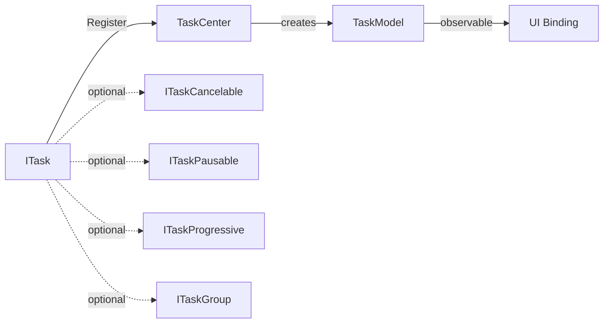

# Tasks Reactive Task System

`Tasks` is a task system based on a reactive model in the PCL CE core library. It is located in the `PCL.Core.App.Tasks` namespace and is used to manage the lifecycle of observable background tasks.

Tasks are registered through `TaskCenter`. After registration, the system creates a `TaskModel` instance that can be bound to the UI, and automatically synchronizes task state, progress, child task collections, and control commands.

::: warning API Status
This API is still under design and development. It may change in future versions. Please refer to the actual behavior.
:::



## Overview

The `Tasks` system uses `ITask` as the basic task unit, `TaskModel` as the UI-observable model, and `TaskCenter` as the task registration and management entry point.

| Concept          | Description                                                                            |
|------------------|----------------------------------------------------------------------------------------|
| Task             | A background execution unit that implements `ITask`                                    |
| Task state       | The task runtime state represented by `TaskState`                                      |
| Task model       | A UI-observable model created by `TaskCenter`                                          |
| Task center      | Responsible for registering tasks, starting tasks, and maintaining the task collection |
| Cancelable task  | A task that implements `ITaskCancelable`                                               |
| Pausable task    | A task that implements `ITaskPausable`                                                 |
| Progressive task | A task that implements `ITaskProgressive`                                              |
| Task group       | A composite task that implements `ITaskGroup`                                          |

The typical data flow of the task system is:

1. The caller creates a task instance that implements `ITask`.
2. The caller registers the task through `TaskCenter.Register`.
3. `TaskCenter` creates the corresponding `TaskModel`.
4. `TaskCenter` subscribes to task state, progress, and child task events.
5. The UI binds to `TaskCenter.Tasks` or the corresponding `TaskModel`.
6. While the task is running, state changes are synchronized to the UI model.

## `ITask`

`ITask` is the core interface for reactive tasks. All tasks that can be registered into the task system must implement this interface.

```cs
public delegate void TaskStateEvent(TaskState state, string message);

public interface ITask
{
    string Title { get; }

    Task ExecuteAsync(CancellationToken cancelToken = default);

    event TaskStateEvent StateChanged;
}
```

### Members

| Member         | Type                   | Description                  |
|----------------|------------------------|------------------------------|
| `Title`        | `string`               | Task title                   |
| `ExecuteAsync` | `Task`                 | Executes the main task logic |
| `StateChanged` | `event TaskStateEvent` | Task state change event      |

### Behavior Contract

`ExecuteAsync` is used to execute task logic. Task implementations should report state changes through `StateChanged` during execution.

`TaskCenter` automatically subscribes to `StateChanged` when a task is registered, and synchronizes the event to the corresponding `TaskModel.State` and `TaskModel.StateMessage`.

Example:

```cs
StateChanged?.Invoke(TaskState.Running, "Start execution");
StateChanged?.Invoke(TaskState.Success, "Execution completed");
```

## `TaskState`

`TaskState` represents the current state of a task.

| Value      | Description            |
|------------|------------------------|
| `Waiting`  | Waiting to run         |
| `Running`  | Running                |
| `Success`  | Completed successfully |
| `Canceled` | Canceled               |
| `Failed`   | Failed                 |

In general, the initial state of a task is `Waiting`. After execution starts, it enters `Running`; after execution ends, it enters `Success`, `Canceled`, or `Failed`.

`TaskCenter.RemoveFinished()` treats tasks whose state is greater than `Running` as completed tasks, namely:

* `Success`
* `Canceled`
* `Failed`

## `ITaskCancelable`

`ITaskCancelable` represents a task that supports cancellation.

```cs
public interface ITaskCancelable
{
    void Cancel();
}
```

After this interface is implemented, the `TaskModel.Cancel` command becomes available.

### Members

| Member     | Description                |
|------------|----------------------------|
| `Cancel()` | Requests task cancellation |

The specific cancellation logic of `Cancel()` is decided by the task implementation. Usually, cancellation can be triggered through `CancellationTokenSource`, and the cancellation state can be checked in `ExecuteAsync`.

## `ITaskPausable`

`ITaskPausable` represents a task that supports pausing.

```cs
public interface ITaskPausable
{
    void Pause();
}
```

After this interface is implemented, the `TaskModel.Pause` command becomes available.

### Members

| Member    | Description           |
|-----------|-----------------------|
| `Pause()` | Requests task pausing |

`Pause()` only defines the entry point for pausing. It does not specify the state transitions after pausing, the resume method, or the internal implementation. The specific behavior is decided by the task implementation.

## `ITaskProgressive`

`ITaskProgressive` represents a task that supports progress reporting.

```cs
public delegate void TaskProgressEvent(double progress);

public interface ITaskProgressive
{
    event TaskProgressEvent ProgressChanged;
}
```

### Members

| Member            | Type                      | Description                |
|-------------------|---------------------------|----------------------------|
| `ProgressChanged` | `event TaskProgressEvent` | Task progress change event |

The value range of `progress` is `0.0` to `1.0`.

After this interface is implemented:

| `TaskModel` property | Value                                         |
|----------------------|-----------------------------------------------|
| `SupportProgress`    | `true`                                        |
| `Progress`           | Synchronized and updated by `ProgressChanged` |

Example:

```cs
ProgressChanged?.Invoke(0.5);
```

## `ITaskGroup`

`ITaskGroup` represents a task group that contains child tasks.

```cs
public delegate void TaskGroupEvent(ITask task);

public interface ITaskGroup : ITask
{
    event TaskGroupEvent AddTask;

    event TaskGroupEvent RemoveTask;
}
```

### Members

| Member       | Type                   | Description              |
|--------------|------------------------|--------------------------|
| `AddTask`    | `event TaskGroupEvent` | Child task added event   |
| `RemoveTask` | `event TaskGroupEvent` | Child task removed event |

A task group itself is also an `ITask`, so it can be registered and executed by `TaskCenter`.

When a task group adds a child task, `TaskCenter` recursively registers the child task and adds its corresponding `TaskModel` to the `Children` collection of the parent task model.

When a task group removes a child task, the corresponding child task model is also removed from the `Children` collection.

## `TaskModel`

`TaskModel` is the UI-observable model generated by the task system. It is based on `ObservableObject` from `CommunityToolkit.Mvvm`.

`TaskModel` is created by `TaskCenter` and should not be manually constructed by callers.

### Properties

| Property          | Type                              | Description                                   |
|-------------------|-----------------------------------|-----------------------------------------------|
| `Title`           | `string`                          | Task title                                    |
| `State`           | `TaskState`                       | Current task state                            |
| `StateMessage`    | `string`                          | Current state description                     |
| `SupportProgress` | `bool`                            | Whether progress display is supported         |
| `Progress`        | `double`                          | Current progress, ranging from `0.0` to `1.0` |
| `IsGroup`         | `bool`                            | Whether this is a task group                  |
| `Children`        | `ObservableCollection<TaskModel>` | Child task model collection                   |
| `Cancel`          | `RelayCommand`                    | Cancel command                                |
| `Pause`           | `RelayCommand`                    | Pause command                                 |

### Command State

| Command  | Available when                                 |
|----------|------------------------------------------------|
| `Cancel` | The original task implements `ITaskCancelable` |
| `Pause`  | The original task implements `ITaskPausable`   |

When a task does not support the corresponding capability, the command is unavailable.

## `TaskCenter`

`TaskCenter` is the registration and management entry point of the task system.

### `Tasks`

`Tasks` is the collection of currently registered task models and can be used directly for UI binding.

```cs
ObservableCollection<TaskModel> allTasks = TaskCenter.Tasks;
```

### `Register`

Registers a task and creates the corresponding `TaskModel`.

```cs
TaskCenter.Register(task, start: true);
```

#### Parameters

| Parameter | Type    | Description                                                                         |
|-----------|---------|-------------------------------------------------------------------------------------|
| `task`    | `ITask` | The task instance to register                                                       |
| `start`   | `bool`  | Whether to execute the task asynchronously immediately. The default value is `true` |

#### Behavior

When registering a task, `TaskCenter` performs the following operations:

* Creates the corresponding `TaskModel`;
* Adds the `TaskModel` to `TaskCenter.Tasks`;
* Subscribes to `ITask.StateChanged`;
* If the task implements `ITaskProgressive`, subscribes to `ProgressChanged`;
* If the task implements `ITaskGroup`, binds child task add and remove events;
* If `start` is `true`, starts `ExecuteAsync` through `Task.Run`.

When the task is a task group, its child tasks are recursively registered and displayed in the `Children` collection of the parent task model.

### `RemoveFinished`

Removes all completed task models.

```cs
TaskCenter.RemoveFinished();
```

Completed tasks are tasks whose state is greater than `TaskState.Running`, including:

* `TaskState.Success`
* `TaskState.Canceled`
* `TaskState.Failed`

This method only removes completed items from the task model collection. It does not mean re-executing cancellation, releasing resources, or rolling back the task’s own business logic.

## Execution and Exception Behavior

When `TaskCenter.Register(task, start: true)` is called, the task is started through `Task.Run`, and its `ExecuteAsync` method is executed.

Exception handling during task execution follows these rules:

| Situation                              | Behavior                                                     |
|----------------------------------------|--------------------------------------------------------------|
| `ExecuteAsync` completes normally      | The task state is reported by the task implementation itself |
| `OperationCanceledException` is thrown | Not treated as an ordinary failure                           |
| Other exceptions are thrown            | The task state is set to `Failed`                            |

The task implementation should still actively report `Success`, `Canceled`, or other states at appropriate points to ensure that the UI model accurately reflects the task result.

## State and Progress Synchronization

`TaskCenter` synchronizes task state to `TaskModel` through event listening.

| Task interface or event            | Synchronization target                      |
|------------------------------------|---------------------------------------------|
| `ITask.StateChanged`               | `TaskModel.State`, `TaskModel.StateMessage` |
| `ITaskProgressive.ProgressChanged` | `TaskModel.Progress`                        |
| `ITaskGroup.AddTask`               | `TaskModel.Children`                        |
| `ITaskGroup.RemoveTask`            | `TaskModel.Children`                        |

Both state and progress are actively reported by the task implementation. The task system does not infer specific business progress.

## Basic Task Example

The following example defines a download task that supports progress reporting and cancellation.

```cs
public sealed class DownloadTask : ITask, ITaskProgressive, ITaskCancelable
{
    private CancellationTokenSource? _cts;

    public string Title => "Download File";

    public event TaskStateEvent? StateChanged;

    public event TaskProgressEvent? ProgressChanged;

    public async Task ExecuteAsync(CancellationToken cancelToken = default)
    {
        _cts = CancellationTokenSource.CreateLinkedTokenSource(cancelToken);

        StateChanged?.Invoke(TaskState.Running, "Starting download");

        for (int i = 0; i <= 100; i++)
        {
            _cts.Token.ThrowIfCancellationRequested();

            ProgressChanged?.Invoke(i / 100.0);

            await Task.Delay(50, _cts.Token);
        }

        StateChanged?.Invoke(TaskState.Success, "Download completed");
    }

    public void Cancel()
    {
        _cts?.Cancel();
    }
}
```

Register the task:

```cs
TaskCenter.Register(new DownloadTask());
```

## Task Group Example

The following example defines a batch download task group.

```cs
public sealed class BatchDownloadGroup : ITaskGroup
{
    private readonly List<ITask> _children = [];

    public string Title => "Batch Download";

    public event TaskStateEvent? StateChanged;

    public event TaskGroupEvent? AddTask;

    public event TaskGroupEvent? RemoveTask;

    public void Add(ITask task)
    {
        _children.Add(task);

        AddTask?.Invoke(task);
    }

    public bool Remove(ITask task)
    {
        if (_children.Remove(task))
        {
            RemoveTask?.Invoke(task);

            return true;
        }

        return false;
    }

    public async Task ExecuteAsync(CancellationToken cancelToken = default)
    {
        StateChanged?.Invoke(TaskState.Running, "Starting batch download");

        await Task.WhenAll(_children.Select(c => c.ExecuteAsync(cancelToken)));

        StateChanged?.Invoke(TaskState.Success, "Batch download completed");
    }
}
```

Register the task group:

```cs
var group = new BatchDownloadGroup();

group.Add(new DownloadTask());
group.Add(new DownloadTask());

TaskCenter.Register(group);
```

After the task group is registered, its child tasks are recursively registered and displayed in the `Children` collection of the corresponding `TaskModel` for the task group.

## API Summary

### Core Interfaces

| API                | Description                                                |
|--------------------|------------------------------------------------------------|
| `ITask`            | Basic reactive task interface                              |
| `ITaskCancelable`  | Task interface that supports cancellation                  |
| `ITaskPausable`    | Task interface that supports pausing                       |
| `ITaskProgressive` | Task interface that supports progress reporting            |
| `ITaskGroup`       | Task group interface that supports a child task collection |

### Event Delegates

| API                 | Description                                 |
|---------------------|---------------------------------------------|
| `TaskStateEvent`    | Task state change event delegate            |
| `TaskProgressEvent` | Task progress change event delegate         |
| `TaskGroupEvent`    | Task group child task change event delegate |

### Models and Management Entry Point

| API          | Description                                  |
|--------------|----------------------------------------------|
| `TaskState`  | Task state enum                              |
| `TaskModel`  | Observable task model                        |
| `TaskCenter` | Task registration and management entry point |

## Usage Recommendations

* Task implementations should actively report state changes and should not rely on `TaskCenter` to infer business state.
* Tasks that support cancellation should implement `ITaskCancelable` and correctly respond to cancellation requests in `ExecuteAsync`.
* Tasks that support progress should keep progress within the range `0.0` to `1.0`.
* Long-running tasks should avoid blocking the calling thread.
* Task groups should trigger the corresponding events when adding or removing child tasks, so that `TaskModel.Children` can be synchronized correctly.
* The UI side should prioritize binding to `TaskCenter.Tasks` and `TaskModel`, and avoid directly depending on the internal state of task instances.