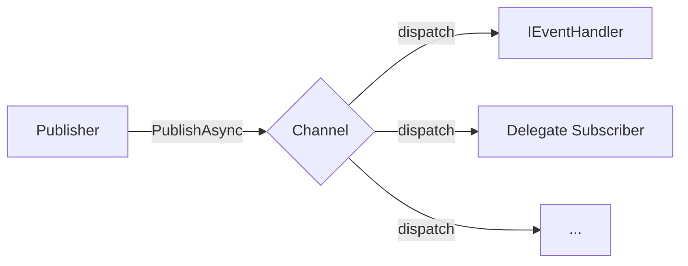

# EventBus 事件总线

EventBus 是基于生命周期服务的发布/订阅式事件总线，位于 `PCL.Core.App.EventBus` 命名空间，用于解耦事件的发布者与处理者。

所有 API 均通过 `EventBusService` 公开。



## 核心类型

### EventDataBase

事件数据的基类，为 `record` 类型：

```cs
public record EventDataBase(Guid Id, string Name);
```

所有自定义事件数据均需继承此类。

### IEventHandler\<TEventData\>

事件处理接口，约束 `TEventData : EventDataBase`：

```cs
public interface IEventHandler<in TEventData> : IDisposable
{
    Task HandleEventAsync(TEventData eventData);
}
```

实现此接口的实例可通过 `Subscribe` 注册为事件处理者。

## 基本用法

### 订阅事件

提供两种订阅方式：

**对象订阅** — 传入 `IEventHandler<TEventData>` 实例：

```cs
EventBusService.Subscribe("channel-name", handler);
```

**委托订阅** — 传入异步委托：

```cs
EventBusService.Subscribe<MyEventData>("channel-name", async data =>
{
    // handle event...
});
```

两种方式均返回 `IDisposable`，调用 `Dispose()` 可取消订阅。若订阅时指定的频道不存在，将自动创建。

### 发布事件

```cs
await EventBusService.PublishAsync("channel-name", new MyEventData(...));
```

所有订阅了该频道且事件数据类型兼容的处理者均会被并行调用。任一处理者的异常不会影响其他处理者的执行。

### 频道管理

可显式创建或移除频道：

```cs
EventBusService.AddChannel("channel-name");
EventBusService.RemoveChannel("channel-name");
```

移除频道会同时清除其所有注册的处理者。

## 生命周期行为

- 服务启动状态为 `BeforeLoading`，在程序早期便处于可用状态。
- 程序停止时，EventBus 会自动清空所有频道与处理者。
- 发布事件时若 EventBus 正在关闭，将抛出 `InvalidOperationException`。

## 垃圾回收

对象订阅通过 `WeakReference<object>` 持有处理者实例。当处理者实例被垃圾回收而其订阅尚未取消时，下次事件派发将自动移除该订阅项。

## 完整示例

以下示例演示从事件定义、处理者实现到订阅与发布的完整流程。

```cs
public sealed record FileDownloadedEvent(Guid Id, string Name, string FilePath)
    : EventDataBase(Id, Name);

public sealed class DownloadNotificationHandler : IEventHandler<FileDownloadedEvent>
{
    public async Task HandleEventAsync(FileDownloadedEvent eventData)
    {
        await File.AppendAllTextAsync("download.log",
            $"[{DateTime.Now}] Downloaded: {eventData.FilePath}\n");
    }

    public void Dispose() { }
}

public static class DownloadManager
{
    private static readonly IDisposable _subscription =
        EventBusService.Subscribe<FileDownloadedEvent>(
            "download", new DownloadNotificationHandler());

    public static async Task DownloadAsync(string url)
    {
        // 下载逻辑...

        await EventBusService.PublishAsync("download",
            new FileDownloadedEvent(Guid.NewGuid(), "download-complete", url));
    }

    public static void Unsubscribe() => _subscription.Dispose();
}
```
