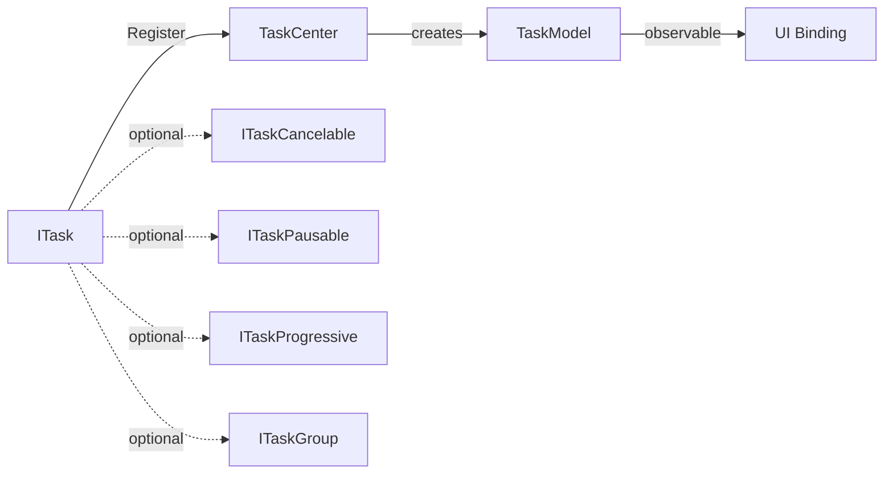

# Tasks 响应式任务系统

Tasks 是基于响应式模型的任务系统，位于 `PCL.Core.App.Tasks` 命名空间，用于管理可观察的后台任务生命周期。

任务通过 `TaskCenter` 注册，自动生成可绑定 UI 的 `TaskModel` 实例。

::: warning API 状态
此 API 仍在设计开发中，后续版本可能存在变动，请以实际行为为准。
:::



## 核心类型

### ITask

响应式任务的核心接口：

```cs
public delegate void TaskStateEvent(TaskState state, string message);

public interface ITask
{
    string Title { get; }
    Task ExecuteAsync(CancellationToken cancelToken = default);
    event TaskStateEvent StateChanged;
}
```

实现者应在 `ExecuteAsync` 的执行过程中，通过 `StateChanged` 事件报告状态变更。`TaskCenter` 会自动订阅该事件并同步至对应的 `TaskModel`。

### TaskState

任务状态枚举：

| 值 | 说明 |
|---|---|
| `Waiting` | 等待执行 |
| `Running` | 正在执行 |
| `Success` | 执行成功 |
| `Canceled` | 已取消 |
| `Failed` | 执行失败 |

### ITaskCancelable

支持取消的任务：

```cs
public interface ITaskCancelable
{
    void Cancel();
}
```

实现此接口后，`TaskModel` 的 `Cancel` 命令将可用。

### ITaskPausable

支持暂停的任务：

```cs
public interface ITaskPausable
{
    void Pause();
}
```

实现此接口后，`TaskModel` 的 `Pause` 命令将可用。

### ITaskProgressive

支持进度报告的任务：

```cs
public delegate void TaskProgressEvent(double progress);

public interface ITaskProgressive
{
    event TaskProgressEvent ProgressChanged;
}
```

`progress` 取值范围为 `0.0` ~ `1.0`。实现此接口后，`TaskModel.SupportProgress` 为 `true`。

### ITaskGroup

包含子任务的任务组：

```cs
public delegate void TaskGroupEvent(ITask task);

public interface ITaskGroup : ITask
{
    event TaskGroupEvent AddTask;
    event TaskGroupEvent RemoveTask;
}
```

子任务会被递归注册，并在 `TaskModel.Children` 中呈现。

### TaskModel

可观察的任务模型，基于 `CommunityToolkit.Mvvm` 的 `ObservableObject`：

| 属性 | 类型 | 说明 |
|---|---|---|
| `Title` | `string` | 任务标题 |
| `State` | `TaskState` | 当前状态 |
| `StateMessage` | `string` | 状态信息 |
| `SupportProgress` | `bool` | 是否支持进度 |
| `Progress` | `double` | 当前进度 (0.0~1.0) |
| `IsGroup` | `bool` | 是否为任务组 |
| `Children` | `ObservableCollection<TaskModel>` | 子任务集合 |
| `Cancel` | `RelayCommand` | 取消命令（不支持取消时为不可用状态） |
| `Pause` | `RelayCommand` | 暂停命令（不支持暂停时为不可用状态） |

## TaskCenter

任务的注册与管理入口。

### 注册任务

```cs
TaskCenter.Register(task, start: true);
```

- `task`：实现 `ITask` 的实例。
- `start`：是否立即异步执行。默认为 `true`。

注册后自动创建 `TaskModel` 并加入 `TaskCenter.Tasks` 集合，同时自动绑定状态、进度、子任务事件。若 `start` 为 `true`，则以 `Task.Run` 启动 `ExecuteAsync`，捕获的异常（`OperationCanceledException` 除外）会将状态置为 `Failed`。

### 观察任务集合

```cs
// 绑定到 UI
ObservableCollection<TaskModel> allTasks = TaskCenter.Tasks;
```

### 清理已完成任务

```cs
TaskCenter.RemoveFinished();
```

移除所有状态大于 `Running`（即 `Success`、`Canceled`、`Failed`）的任务模型。

## 完整示例

```cs
public sealed class DownloadTask : ITask, ITaskProgressive, ITaskCancelable
{
    private CancellationTokenSource? _cts;

    public string Title => "下载文件";

    public event TaskStateEvent? StateChanged;
    public event TaskProgressEvent? ProgressChanged;

    public async Task ExecuteAsync(CancellationToken cancelToken = default)
    {
        _cts = CancellationTokenSource.CreateLinkedTokenSource(cancelToken);
        StateChanged?.Invoke(TaskState.Running, "开始下载");

        for (int i = 0; i <= 100; i++)
        {
            _cts.Token.ThrowIfCancellationRequested();
            ProgressChanged?.Invoke(i / 100.0);
            await Task.Delay(50, _cts.Token);
        }

        StateChanged?.Invoke(TaskState.Success, "下载完成");
    }

    public void Cancel() => _cts?.Cancel();
}

// 注册
TaskCenter.Register(new DownloadTask());
```

## 任务组示例

```cs
public sealed class BatchDownloadGroup : ITaskGroup
{
    private readonly List<ITask> _children = [];

    public string Title => "批量下载";

    public event TaskStateEvent? StateChanged;
    public event TaskGroupEvent? AddTask;
    public event TaskGroupEvent? RemoveTask;

    public void Add(ITask task)
    {
        _children.Add(task);
        AddTask?.Invoke(task);
    }

    public bool Remove(ITask task)
    {
        if (_children.Remove(task))
        {
            RemoveTask?.Invoke(task);
            return true;
        }
        return false;
    }

    public async Task ExecuteAsync(CancellationToken cancelToken = default)
    {
        StateChanged?.Invoke(TaskState.Running, "开始批量下载");
        await Task.WhenAll(_children.Select(c => c.ExecuteAsync(cancelToken)));
        StateChanged?.Invoke(TaskState.Success, "批量下载完成");
    }
}

// 注册任务组（子任务会自动递归注册）
var group = new BatchDownloadGroup();
group.Add(new DownloadTask());
group.Add(new DownloadTask());
TaskCenter.Register(group);
```
